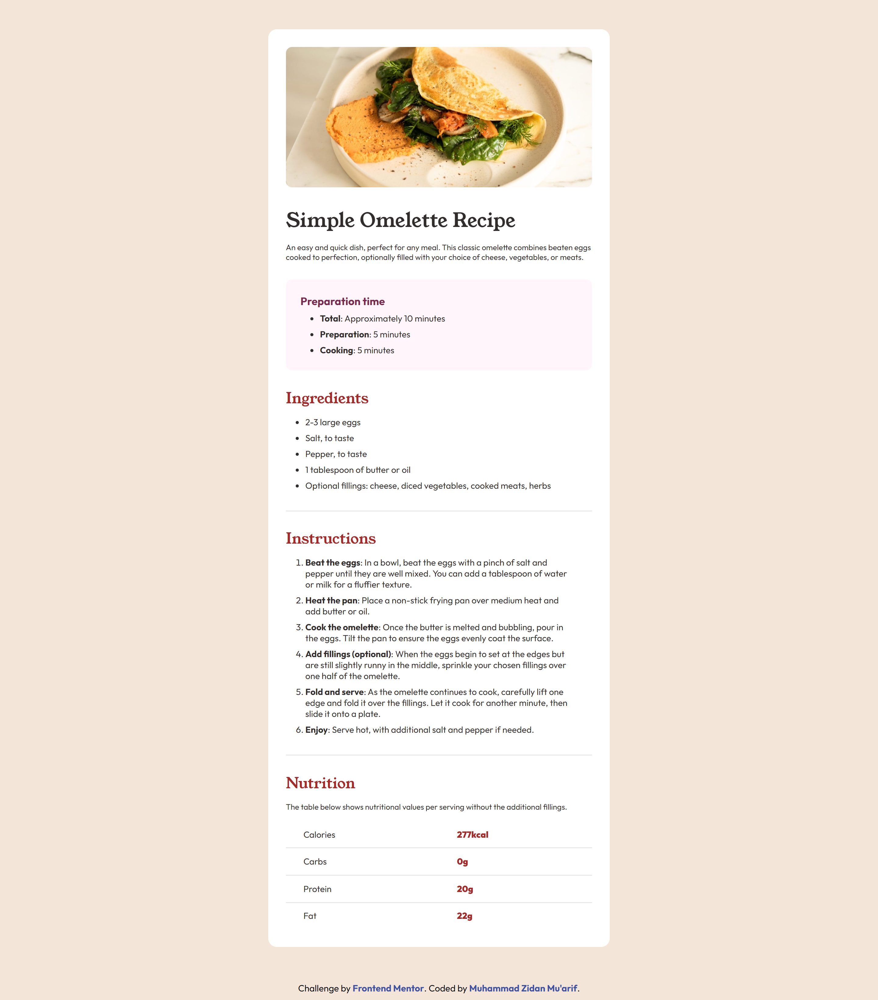
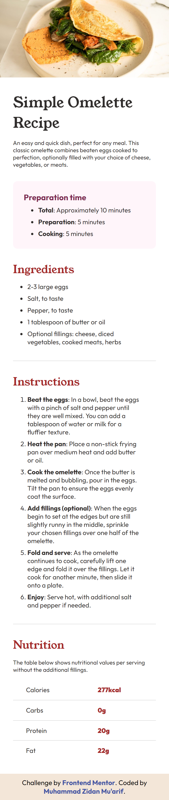

# Frontend Mentor - Recipe page

## Welcome! 👋

# Frontend Mentor - Recipe page solution

This is a solution to the [Recipe page challenge on Frontend Mentor](https://www.frontendmentor.io/challenges/recipe-page-KiTsR8QQKm). Frontend Mentor challenges help you improve your coding skills by building realistic projects.

## Table of contents

- [Overview](#overview)
  - [Screenshot](#screenshot)
  - [Links](#links)
- [My process](#my-process)
  - [Built with](#built-with)
- [Author](#author)

## Overview

### Screenshot

### Links

- Solution URL: [Here](https://www.frontendmentor.io/solutions/responsive-landing-page-using-css-flexbox-arLs8iyZZH)
- Live Site URL: [Here](https://zidannn24.github.io/FM-Recipe-Page/)

## My process

### Built with

- Semantic HTML5 markup
- CSS custom properties
- Flexbox

## Author

- Frontend Mentor - [@zidannn24](https://www.frontendmentor.io/profile/zidannn24)
- Github - [@zidannn24](https://github.com/zidannn24)